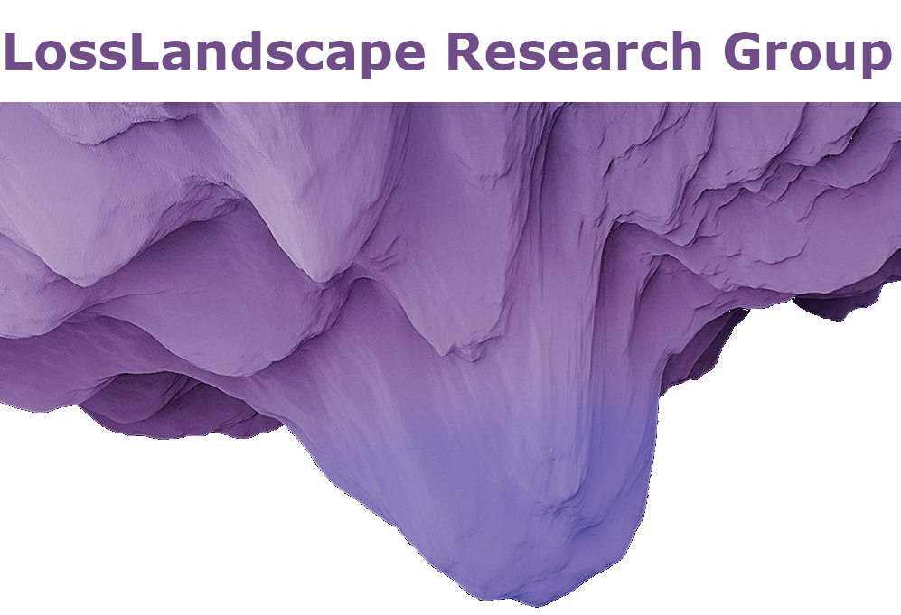

# ACSE 4 Machine Learning Group Project

## X-Ray Classification

All information available here: https://www.kaggle.com/c/acse4-ml-2020

<!-- PROJECT LOGO -->

<br />
<p align="center">
  <a href="https://github.com/acse-2020/acse-4-gormanium-rush-hematite">
    
  </a>

<h3 align="center">LossLandscape Research Group</h3>

<p align="center">
    The LLRG located within Imperial College London's ESE Department
    <br />
    <a href="https://github.com/acse-2020/acse-4-gormanium-rush-hematite"><strong>Explore the docs»</strong></a>
    <br />
    <br />
    <a href="https://github.com/acse-2020/acse-4-gormanium-rush-hematite/issues">Report Bug</a>
  </p>
</p>

<!-- TABLE OF CONTENTS -->

<details open="open">
  <summary>Table of Contents</summary>
  <ol>
    <li>
      <a href="#about-the-project">About The Project</a>
    </li>
    <li>
      <a href="#getting-started">Getting Started</a>
      <ul>
        <li><a href="#prerequisites">Prerequisites</a></li>
        <li><a href="#installation">Installation</a></li>
      </ul>
    </li>
    <li><a href="#usage">Usage</a></li>
    <li><a href="#license">License</a></li>
    <li><a href="#contact">Contact</a></li>
    <li><a href="#acknowledgements">Acknowledgements</a></li>
  </ol>
</details>

<!-- ABOUT THE PROJECT -->

## About The Project

The LossLandscape research group presents to you a classifier that identifies chest x-ray images of healthy patients, patients that have lung-opacity, pneumonia or covid-19 using machine learning. 

Features:

* Ensemble method that makes composite model out of three machine learning networks
* Wide range of possible models to implement(ResNet, GoogLeNet, SqueezeNet etc.)
* Accurate results.
* Elegant visualization showing functionality using wandb.ai.
* Stable and continuous software maintenance using Github Actions. 

<!-- GETTING STARTED -->

## WANDB Runs
Here are our Weights and Biases runs:

[Resnet](https://wandb.ai/losslandscape21/transfer_resnet50/reports/Resnet-50--Vmlldzo3MTIzMTQ)

[GoogleNet](https://wandb.ai/losslandscape21/transfer_googlenet/reports/GoogleNet-runs--Vmlldzo3MTIzMjQ)

[AlexNet](https://wandb.ai/losslandscape21/transfer_alexnet/reports/AlexNet--Vmlldzo3MTIzNTc)

[SqueezeNet](https://wandb.ai/losslandscape21/transfer_squeezenet/reports/Squeezenet--Vmlldzo3MTIzNTI)

## Prerequisites

* Python 3.7 or above
* Tensorflow, CUDA and Jupyter libraries
* GPU Accelerator
## Getting Started

```sh
git clone https://github.com/acse-2020/acse-4-x-ray-classification-losslandscape
```

## Installation

1. Change your directory to cloned folder "cd ./acse-4-x-ray-classification-losslandscape
2. In this directory you will find the two notebooks. See usage for how to use these notebooks.

<!-- USAGE EXAMPLES -->

## Usage

There are two notebooks within the repo.

* Notebook 1 (Full_run.ipynb)

This notebook includes an examplary walkthrough of one of the models of the ensemble methods, the SqueezeNet. It also highlights the data augmentation methods that we used and a confusion matrix to give a little insight into how we analyzed the data. Note that this notebook is set up to be ran on Google Colab.

* Notebook 2 (Ensemble_Method.ipynb)

This notebook contains the entire ensemble method. Running this notebook should reproduce the final submission that is our top submission in the Kaggle leaderboards. Note that this notebook is set up to be ran on a local machine with cuda installed and set up to work with PyTorch.

* We also included our weights and biases notebooks in a subfolder called `wandb`. These are not necessarily the submitted notebooks, but rather for reference.

<!-- ACKNOWLEDGEMENTS 
_For more information, please refer to the report in this repo_
-->
<!-- LICENSE -->

## License

Distributed under the MIT License. See `LICENSE` for more information.

<!-- CONTACT -->


## Contact (Names not listed in order)

* Davies, Calvin calvin.davies20@imperial.ac.uk
* Wolffs, Zef zef.wolffs20@imperial.ac.uk
* Go, Hanna hanna.go17@imperial.ac.uk
* Nenov, Nenko nenko.nenov@imperial.ac.uk
* Jie Zhu jie.zhu20@imperial.ac.uk
* Pozzetti, Andrea ap2920@imperial.ac.uk
* Tao, Ranran ranran.tao20@imperial.ac.uk
* Xiangqi, Liu xl620@imperial.ac.uc.uk

  Project Link: [https://github.com/acse-2020/acse-4-x-ray-classification-losslandscape](https://github.com/acse-2020/acse-4-x-ray-classification-losslandscape)

<!-- ACKNOWLEDGEMENTS -->

## Acknowledgements

* PyTorch
* Google (Colab not so much since it kicked us off an hour before the deadline ;) )

<!-- MARKDOWN LINKS & IMAGES -->

<!-- https://www.markdownguide.org/basic-syntax/#reference-style-links 
[contributors-shield]: https://img.shields.io/github/contributors/acse-2020/group-project-the-uploaders.svg?style=for-the-badge
[contributors-url]: https://github.com/acse-2020/acse-4-x-ray-classification-losslandscape/graphs/contributors
[issues-shield]: https://img.shields.io/github/issues/acse-2020/group-project-the-uploaders.svg?style=for-the-badge
[issues-url]: https://github.com/acse-2020/acse-4-x-ray-classification-losslandscape/issues
[license-shield]: https://img.shields.io/github/license/acse-2020/group-project-the-uploaders.svg?style=for-the-badge
[license-url]: https://github.com/acse-2020/acse-4-x-ray-classification-losslandscape/blob/main/LICENSE.txt
-->
